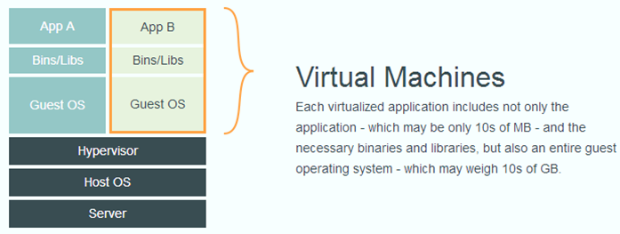

<!-- $theme: gaia -->
<!-- *template: invert -->
# Docker、Kubernetes、微云介绍

###### Created by 姜岳松

---
<!-- *template: invert -->
# Docker

---

# 什么是docker？
一种虚拟化技术,提供隔离的运行环境
1. Docker 容器
2. Docker 镜像


---
# docker容器
一个独立于宿主机的运行环境，类比于windows上安装的虚拟机是完全独立的系统

但是与虚拟机不同的是，虚拟机是完全独立的，但是Docker容器使用的是宿主机的内核，所以更轻量，占用资源少

---
# docker容器与宿主机的对比



---
# docker镜像
装windows时需要windows的iso镜像一样，创建docker容器也需要镜像

Docker镜像不是一个独立的文件，而是一个虚拟的概念，由很多层组成。

我们可以把镜像保存成一个tar包。目前程序打包发布的images目录下，就是镜像对应的tar包

---
# 为什么使用docker
1. 装一个软件，但是折腾了半天配置，还是运行不起来？

2. 系统装了JDK7,但是运行需要JDK8？

3. 机器要跑很多应用，配置会冲突？

---
# 镜像从哪里来

1. 镜像仓库，可以是自己的，也可以是公共的，类似于maven reposity
	```
	docker pull centos7:latest
    ```
2. 从tar包加载```docker load -i xxx.tar```
4. dockerfile自己构建:使用 ```docker build```命令根据dockerfile建立镜像到本地， 通过```docker save -o xxx.tar image:tag```将镜像保存成tar包
3. 存储运行中的镜像：```docker commit```

---

# Dockerfile示例
```
FROM centos7-openjdk8:v1.0

RUN mkdir -p /usr/local/app
WORKDIR /usr/local/app

# 配置系统缺少的库文件
COPY libgomp.so.1.0.0 /lib64/
RUN ln -sf /lib64/libgomp.so.1.0.0 /lib64/libgomp.so.1
ENV LD_LIBRARY_PATH=${LD_LIBRARY_PATH}:/usr/local/app
# copy data to image
COPY .  /usr/local/app/

RUN chmod +x /usr/local/app/run.sh && \
	chmod +x /usr/local/app/run-s.sh

CMD ["./run.sh"]
```
---
# Dockerfile示例
```
docker build -f Dockerfile -t viid-mda:v1.0 .
```

- -f 指定docker file文件，如果是```Dockerfile```且在当前文件夹，可省略
- -t 指定镜像的tag， 镜像的tag就是镜像的名称，例如我们使用的viid-face-snap:V100R001B01D001,冒号前的镜像的名称，冒号后是镜像的版本，如果不写版本，默认是latest
- 最后有个```.```，这个代表当前目录，dockerfile中对文件的操作都是基于这个目录的，也可以指定为其它目录

---


查看本地镜像：```docker images```
```
REPOSITORY          TAG                 IMAGE ID            CREATED             SIZE
centos7-openjdk8    v2.0                ef5f5d6d059f        2 minutes ago       536MB
centos              7.5.1804            76d6bc25b8a5        4 months ago        200MB
registry:5000/viid-pg	10.5			76d6bc25b8a5		4 months ago		200MB
docker.io/jys/test	latest				76d6bc25b8a5		4 months ago		200MB
```
镜像名中：
- 第一部分是仓库地址，默认是docker官方，没有地址的，可能是本地镜像，也可能是官方仓库镜像
- 第二位是用户名，官方镜像或者本地镜像没有
- 第三位是镜像名

---

# 从镜像到容器
```docker run  –d  imagename:version args```
- -d是后台运行
- args是运行参数

---

例如我要将上面的mda运行起来，可以使用
```
docker run -d --name viid-mda -p 2530:2530 -v 
/home/viid:/home viid-mda:2.0.0 java -jar mda.jar 
--spring.profiles.active=product
```
解释：
- --name 指定容器的名字，方便查找操作
- -p 指定端口，格式为宿主机端口:容器端口
- -v 指定挂载卷(volume)，格式为容器外目录：容器内目录
- -d 后台运行，可以使用-it代替使程序前台运行

---
说明：
- 容器是和外部隔绝的，所以需要使用-p暴露容器端口到宿主机端口；
- 容器的文件，在容器重启、停止后也会消失，所以指定volume,将容器内的某个目录和容器外目录绑定，这样容器的绑定目录下的文件都会存储在容器外的目录。容器删除了文件也依旧存在。

---

### 实例2：

```
docker run -it --rm --name test -p 2530:2530 
-v /home/viid:/home viid-mda:2.0.0 java -jar mda.jar
--spring.profiles.active=product
```
在前台启动mda，--rm指明结束后自动删除容器，适合调试时使用。

### 实例3
```
docker run -it --rm viid-mda:2.0.0 /bin/bash
```
在前端启动mda容器，并进入，但是没有运行任何应用

---

### 实例4
```
docker run -d --name test viid-mda:2.0.0  tail -f /dev/null
```
上述运行容器，执行了一个永不结束的命令```tail -f /dev/null```, 这样可以方便进入容器查看文件，也可以在容器内手动将程序运行起来

---
# 容器管理
- docker ps查看正在运行的容器
```
CONTAINER ID        IMAGE                           COMMAND                  CREATED              STATUS              PORTS               NAMES
00e45b49936b        dbbbe3ccff11                    "/bin/sh -c 'cd /mnt…"   About a minute ago   Up About a minute                       k8s_vms-tas-container_vms-tas-pod-7fc565948f-24dlh_default_de674771-3fea-11e9-a34a-000af7eb97a0_0
f5a6806408aa        71fa7369f437                    "/bin/sh /home/confi…"   About a minute ago   Up About a minute                       k8s_pod-keepalive_vms-tas-pod-7fc565948f-24dlh_default_de674771-3fea-11e9-a34a-000af7eb97a0_0
2e589be90f0c        registry:5500/pause-amd64:3.1   "/pause"                 About a minute ago   Up About a minute                       k8s_POD_vms-tas-pod-7fc565948f-24dlh_default_de674771-3fea-11e9-a34a-000af7eb97a0_0
fee19e3c8551        0c994687a895                    "./vrserver-40101"       2 hours ago          Up 2 hours                              k8s_vrserver-40101_vias-vr-40101-pod-0_default_4b974204-3fde-11e9-a34a-000af7eb97a0_0
```

- docker exec -it {container name} /bin/bash 进入容器
	例如上述容器，进入mda为```docker exec -it viid-mda /bin/bash```
   	其中，容器名可以用id代替，id只需要前几位即可，不用写全

---

---
<!-- *template: invert -->
# kubernetes
---

# 什么是kubernetes
一个容器编排工具，用于管理容器
试想以下场景：
1. 集群部署，每台机器上都要启动？
2. 容器挂了怎么办？
3. 配置太多，命令行太长
4. 容器之间相互依赖

也许可以用脚本，但是还是需要在每台机器上运行脚本，当集群比较大时，工作量可想而知。docker提供了docker-compose用于单机的容器编排，而Kubernetes就是为了解决集群的容器管理

---
# Kubernetes功能
- 容器的管理
	负责启动容器/监控容器状态（失败重启）
- 容器的调度
	调度到某一台物理机/修改副本数扩容/调度策略（label，优先级，抢占策略）
- 服务发现
	通过kube-dns实现基于服务名的服务发现
- 负载均衡
	service提供负载均衡功能，也可以接入第三方的负载均衡

---
# kubernetes概念
简称**K8S**
## 概念
- Master
	集群的主节点，负责集群容器的调度，状态的监控
- Node
	集群的普通节点，负责运行pod
- Pod
	k8s管理的最小单位，一个pod内运行多个容器，k8s的操作都是以pod为单位

---
# kubernetes架构
一台装有k8s的主机可以同时作为master和node节点，可以通过命令```kubectl get node```查看
一台物理机(node)上可以运行多个pod，每个pod内可以运行多个container， 同一个pod内的多个container可以通过localhost访问。 


---

# Pod
```kubectl get pods (-o wide)```查看pod信息
```
NAME             READY     STATUS      RESTARTS   AGE
viid-pg-0	 1/1       Running     0          1d
viid-mda-0       1/1       Running     2          15d
viid-mda-1	 1/1       Running     0          1d
```
---

# Pod
多种情况:
1. 一个pod多个容器，每个人容器运行一个或多个程序
2. 一个pod一个容器，容器运行一个或多个程序
3. 建议一个pod运行一个或多个容器，每个容器运行一个程序，方便资源控制

---

# Pod
- name:使用deployment-随机字符串，或者statefulset-序号命名，直接创建的pod则使用pod设定的名字
- ready：正常运行的容器/pod容器数
- status：状态，pending准备调度；init:0/1初始化容器运行；PodInitiliazing：pod初始化； runing正常运行；CrashLoopBackOff：Pod中的容器一直启动报错；terminiting:停止中；Completedpod运行完成；Error：pod调度多次仍然不能正常运行。

- restarts:重启次数
- AGE：运行时长

---
# Pod
## 查看问题
```kubectl describe pod viid-mda-0``` 查看pod信息，配置文件中配置最终会转换为pod的配置，可以根据此命令查看配置是否和配置文件一致，是否正确;同时，该命令会显示pod运行前的信息，在遇到pod一直处于pending状态的问题时可以查看（通常是资源不足，无法调度）

---
# Pod
## 查看问题
```kubectl logs viid-mda-0 (-c viid-init-common）```查看pod内容器的日志，只有一个容器时，可以不指定-c，有多个容器时，使用-c指定容器，上述是查看mda-0的日志，如果pod处于init状态，-c指定初始化的容器

初始化容器：在容器内进行一些初始化操作，如等待某个pod运行，初始化容器完成退出后，pod的容器才会开始运行

---
# service
k8s对外提供服务的方式，目前我们使用的有两种，clusterip, 和nodeport。
- clusterip的方式，ip只能在集群内访问，即只有在集群内的node上才能访问；
- nodeport会生成一个物理机端口，可以通过物理机ip进行访问

```kubectl get svc```查看

---

```
NAME                          TYPE        CLUSTER-IP       EXTERNAL-IP   PORT(S)                                                                 AGE
app-web                       NodePort    10.254.56.126    <none>        8000:8800/TCP                                                           1d
broker                        ClusterIP   None             <none>        9093/TCP                                                                15d
default-http-backend          ClusterIP   10.254.147.200   <none>        80/TCP                                                                  15d
```
- Name：service的名字
- type：类型，
- clusterip：集群内ip， None是一种特殊的类型，没有ip，不能提供访问
- EXTERNAL-IP：一种service类型的配置，无需了解
- ports：对外端口：集群ip端口/端口类型。对外端口是可使用node ip +端口访问，集群ip是在集群内使用cluster ip+端口访问

---
# controller

如果我定义一个pod，则只是运行一个pod，但是我们需要多副本的管理，就要用到k8s的contrallor类型的组件。
contrallor的作用是：根据声明的副本数创建并调度指定数量的pod
- Replication
	早期的调度组件，现在已经不推荐使用

---
# controller
- Deployment
	无状态调度，各个节点之间平等，pod的每个副本名称为deployname+随机数
    ```kubectl get deploy xxx```查看
- Statefulset
	有状态调度，每个节点是有状态的（有唯一的节点id），具体如何利用节点id这个状态，由业务决定。
    ```kubectl get sts xxx```查看
    在容器中，环境变量```HOSTNAME```为xxx-0, xxx-1的形式

---
# 存储
把容器内的目录映射到容器外的空间。容器内的文件，每次容器重启时都会重置，文件的修改都是不保存的，只有将文件、目录映射到容器外的空间才能持久化保存。
- PV（persistent volume)
	定义了一种存储
- PVC（persistent volume claim)
	是一个声明，每个pvc都会绑定一个pv后才能使用，pod直接绑定pvc，可以动态替换pv的实现，而对pod无感知
    
---

# configMap
可以理解为一直存储，用于存储少量的配置信息。
可以将一个或多个文件，也可以将一个文件夹定义为一个configmap。
configmap可以当做存储卷，挂载到容器的某一个目录中。
也即将configmap代表的文件、文件夹放到容器中

---
# yaml 配置文件

---
# 命令行操作
## 1. 从yaml到kubernetes资源
``` kubectl apply -f test.yaml```
修改yaml后，再次执行该命令，可应用修改后的配置
删除对象：
```kubectl delete -f test.yaml```

---

# 命令行操作

1. ```kubectl get <resource>```
2. ```kubectl get <resource> -o wide```
4. ```kubectl describe <resource> <resource_name>```
5. ```kubectl logs <pod_name> -c <container_name>```
6. ```kubectl delete <resource> <resource_name>```

resource可以为：node,pod,service,deployment,statefulset,configmap，pv,pvc等等yaml中一切为kind的东西。 service可以简写为svc, deployment简写deploy,statefulset简写sts， configmap简写cm

---
# 命令行操作
kubernetes也有类似于docker exec的命令：kubectl exec 
```
kubectl exec -it (-c container_name) pod_name /bin/bash
```

---

# Thanks for Your Attention~!

