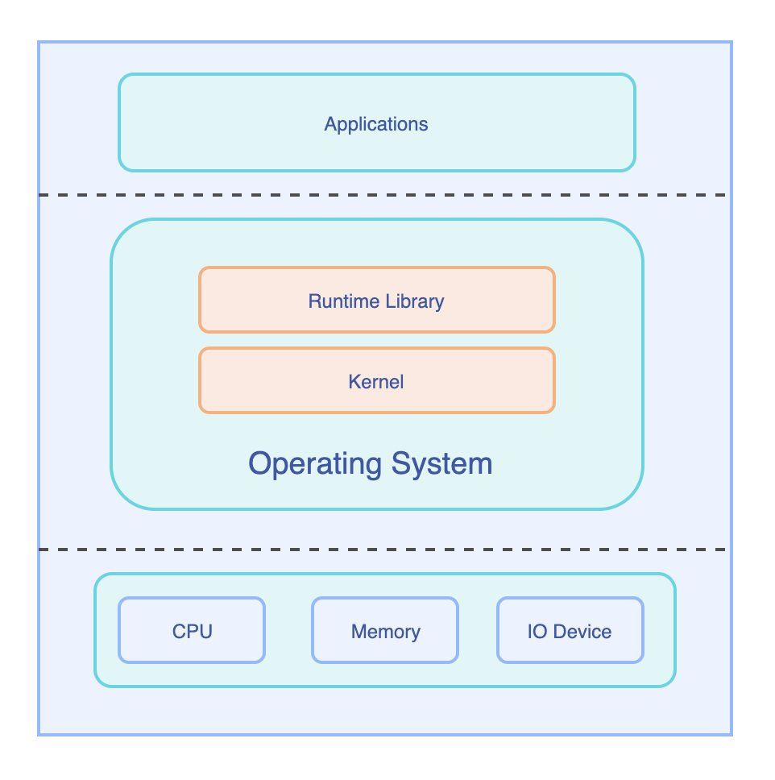
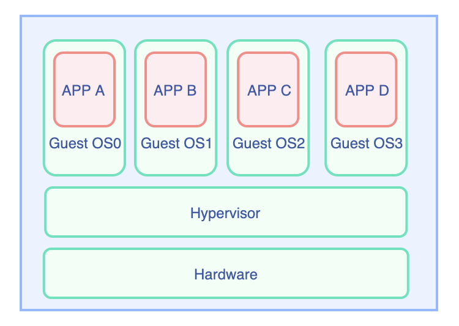
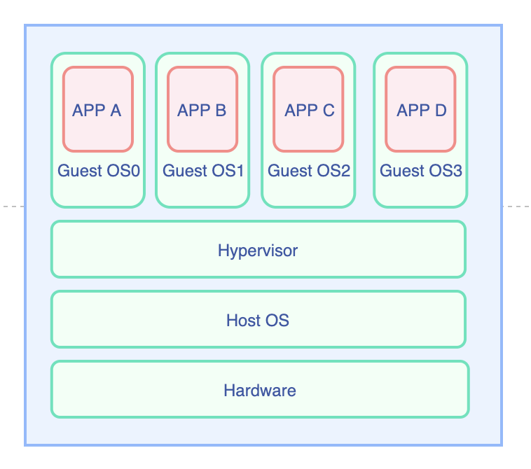
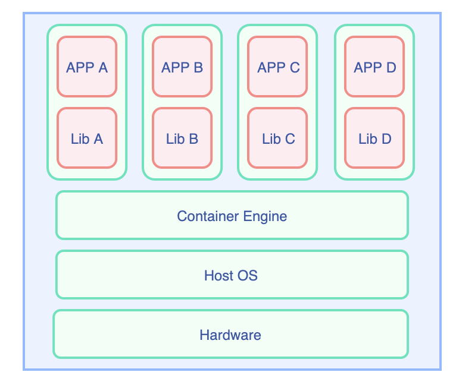
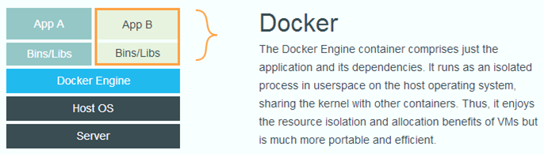

<!-- 
_class: lead gaia
_paginate: false 
-->

# Docker&Kubernetes
## 概念和基础操作

Created by 姜岳松

---
<!-- backgroundColor: white -->

# Docker

---
<!--header: Docker-->
## 什么是docker？

> 一个工具平台,对linux容器的封装，提供简单易用的接口，方便开发者快速的构建、部署和管理容器化的应用。

要理解docker，首先要明白**容器**的概念

---
完整的计算机组成（右图）



操作系统负责管理底层的硬件资源，并通过内核+运行库为软件提供运行环境。

存在的问题
- cpu、内存很大，性能过剩
- 多应用依赖互相影响，资源抢占
- 安装复杂

---
### 解决方案
#### 1 硬件虚拟化Hypervisor
又叫做虚拟机监视器,有两种形式

优点：可以在一台物理机上安装不同的系统
缺点：Guest OS占用硬件资源

于是操作系统层虚拟化——容器概念的提出,多个应用使用同一个操作系统。





---
#### 2 Linux cgroup+namespace
- cgroup：实现资源隔离
- namespace：网络、磁盘、主机名、PID、用户隔离

应用和运行库打包在一起，构成容器实现隔离
- 优点：共享操作系统，启动快，占用资源少
- 缺点：配置、使用复杂



---
### 容器技术的本质
容器本质上是一个`集装箱`，它将应用运行依赖的`系统库`、`环境`及`应用程序`本身要包到一起，这样将整个集装箱迁移到另外的环境，可以保证程序`隔离不受干扰地`完美地运行起来。

docker是为了降低容器技术使用的复杂性而诞生的。

---
## docker概念--镜像


docker把上述的App+Lib打包成"一个"文件，称为镜像，包含系统本身和依赖的环境。

Docker镜像不是一个独立的文件，而是采用unionfs将多个文件合并而成。镜像构建过程中的每一步操作，都会形成一个增量的文件(layer)。类似快照，多个镜像可以共享相同的layer。

---
## docker概念--容器
容器是镜像的一个运行实例。

容器和容器之间，容器和宿主机都是完全隔离的。具体体现：
1. 可控制容器的cpu/内存资源分配
2. 网络隔离：互相之间不可访问
3. 存储隔离，且容器运行中产生的文件和容器相同的生命周期

---
## 为什么使用docker
1. 装一个软件，但是折腾了半天配置，还是运行不起来？
2. 系统装了JDK7，但是运行需要JDK8？

---
## 镜像从哪里来
1. **镜像仓库**：可以是私有的，也可以是公共的，通过`docker pull`从远程仓库获取到本地仓库
2. 使用`docker load`从tar包加载，镜像也可以存储为tar包
4. **使用dockerfile构建**：dockerfile声明了镜像的构建过程
3. 存储运行中的镜像：`docker commit`

---
## Dockerfile示例

```
FROM node:12-alpine
RUN apk add --no-cache python g++ make
WORKDIR /app
COPY . .
RUN yarn install --production
CMD ["node", "src/index.js"]
```

[代码下载](https://github.com/docker/getting-started/tree/master/app)

---

## 从镜像到容器
`docker run  –d  imagename:version args`
- -d是后台运行
- args是运行参数

---
## docker architecture


---
<!-- _class: lead -->
## Docker命令实践

---
### 构建镜像
```
docker build -f Dockerfile -t getting-started:v1 .
```

- -f 指定docker file文件，如果是`Dockerfile`且在当前文件夹，可省略
- -t 指定镜像的tag， 镜像的tag就是镜像的名称+版本，如果不写版本，默认是latest
- 最后有个`.`，这个代表当前目录，dockerfile中对文件的操作都是基于这个目录的，也可以指定为其它目录
- 查看本地镜像：`docker images`

---
### 运行容器
例如我要将上面的程序运行起来，可以使用
```
 docker run -d -p 3000:3000 --name demo -v /home/test:/Users/jiangys/docker/test getting-started:v1
```
解释：
- --name 指定容器的名字，方便查找操作
- -p 指定端口，格式为宿主机端口:容器端口
- -v 指定挂载卷(volume)，格式为容器外目录：容器内目录
- -d 后台运行，可以使用-it代替使程序前台运行

---
#### 实例2：

```
docker run -it --rm -p 3000:3000 --name demo -v /home/test:/Users/jiangys/docker/test getting-started:v1
```
在前台启动，--rm指明结束后自动删除容器，适合调试时使用。

#### 实例3
```
docker run -it --rm getting-started:v1 /bin/bash
```
在前端启动容器，并进入，但是没有运行任何应用

---
#### 实例4
```
docker run -d --name test getting-started:v1  tail -f /dev/null
```
上述运行容器，执行了一个永不结束的命令`tail -f /dev/null`, 这样可以方便进入容器查看文件，也可以在容器内手动将程序运行起来

---
### 容器管理
- docker ps查看正在运行的容器

- docker exec -it {container name} /bin/bash 进入容器
	例如上述容器，进入mda为```docker exec -it demo /bin/bash```
   	其中，容器名可以用id代替，id只需要前几位即可，不用写全

---
# kubernetes(k8s)


---
<!--header: Kubernetes-->
## docker使用中的问题
试想以下场景：
1. 集群部署，每台机器上都要启动一堆容器，要配置网络
2. 容器挂了怎么办？
3. 容器之间相互依赖
4. 扩容，缩容
5. 集群资源的规划

docker提供了docker-compose用于单机的容器编排，而Kubernetes就是为了解决集群的容器管理

---

## 什么是kubernetes
一个容器编排工具，用于管理容器
- 容器的管理：负责启动容器/监控容器状态（失败重启）
- 容器的调度：调度到某一台物理机/修改副本数扩容/调度策略（label，优先级，抢占策略）
- 服务发现：通过kube-dns实现基于服务名的服务发现
- 负载均衡：service提供负载均衡功能，也可以接入第三方的负载均衡

---
## kubernetes概念
### 组件
- 控制平面：运行在集群master点，负责集群容器的调度，状态的监控
  - api-server
  - etcd
  - kube-scheduler
  - controller-manager

--- 
- Node：集群的普通节点，负责运行pod，包括
  - kubelet：和master通信，管理pod
  - kube-proxy：网络代理，实现容器内外访问
  - 容器运行时，一般是docker

一台装有k8s的主机可以同时作为master和node节点，可以通过命令`kubectl get node`查看

---
### Pod（豆荚）
k8s最小的管理单元。

通过yaml声明，每个pod内可以运行多个container， 同一个pod内的多个container共享外部存储和网络，可以通过localhost访问。

k8s把docker中容器级别的隔离，变成了pod级别的隔离。

一个node上可以运行多个pod

---
### 架构图


---
### workload工作负载
如果定义一个pod，则只是运行一个pod，和之前单独运行一个docker容器没有本质上的区别。

真正实现k8s的强大的调度功能，需要依靠工作负载类型的组件。

工作负载的作用是：根据声明**创建并调度和管理一组pod**，不同的组件对pod的管理方式不同，但是都具有多副本管理，根据pod声明的cpu、内存等资源进行调度，根据node标签调度等功能。

---
#### deployment
无状态调度器，作用是创建并管理指定副本数量的pod。
特点：
- 无状态，所有pod等价
- 支持并行扩容缩容
- 支持历史版本和回滚

---
#### Statefulset
具有deployment的大部分功能（没有历史版本，没有并行扩容缩容）
特点：
- pod有状态，每个pod有唯一的节点id（0～N-1），id体现在podname和容器的hostname中，具体如何利用节点id这个状态，由业务决定。
- 顺序启动、逆序停止、更新
- 每个pod操作前，其前一个pod一定是running状态
- 利用集群dns，可以实现通过域名访问指定pod

---
### service
workload声明了如何管理pod，但是pod的网络依旧是隔离的，Service用来声明pod如何对外提供服务。
pod在创建的时候，就提供了pod-ip，通过pod-ip+容器的端口可以访问pod。但是pod更新后ip会发生变化，不可能手动为同一服务的pod配置ip。
service则可以管理一组pod，service创建后，也会生成对应的service-ip，service通过标签匹配pod，监控具有指定标签的pod变化，访问service-ip可以路由到被service管理的pod。
service的种类：
- clusterip：ip只能在集群内访问，即只有在集群内的node上才能访问
- nodeport：会生成一个物理机端口，可以通过物理机ip进行访问
- loadbalancer：使用云厂商提供的负载均衡功能

---
### 存储
容器和pod的存储和物理机是隔离的，存储的作用是把容器内的目录映射到容器外的空间。
容器内的文件，每次容器重启时都会重置，文件的修改都是不保存的，只有将文件、目录映射到容器外的空间才能持久化保存。
- PV（persistent volume)：预先定义的存储，直接绑定到pod上
- PVC（persistent volume claim)：存储的声明，pod在创建的时候，根据pvc的声明，动态的创建pv
    
---
### configMap
可以理解为一种只读存储，用于存储少量的配置信息，只支持文本文件

可以将一个或多个文件，也可以将一个文件夹定义为一个configmap。

configmap可以挂载到容器的某一个目录中，也即将configmap代表的文件、文件夹放到容器中。在容器外对configMap进行更改，容器内的文件也会相应更改

---
<!-- _class: lead -->
# kubernetes实践

---
## Pod
```kubectl get pods (-o wide)```查看pod信息
多种使用方式:
1. 一个pod多个容器，每个容器运行一个或多个程序 ❌
2. 一个pod一个容器，容器运行一个或多个程序 ❌ ---不方便管理和监控
3. 建议一个pod运行一个或多个容器，每个容器运行一个程序，方便资源控制

---
## Pod

```kubectl describe pod {pod-name}``` 查看pod信息，配置文件中配置最终会转换为pod的配置，可以根据此命令查看配置是否和配置文件一致，是否正确;同时，该命令会显示pod运行前的信息，在遇到pod一直处于pending状态的问题时可以查看（通常是资源不足，无法调度）

---
## Pod

```kubectl logs {pod-name} (-c {container-name}）```查看pod内容器的日志，只有一个容器时，可以不指定-c，有多个容器时，使用-c指定容器

初始化容器：在容器内进行一些初始化操作，如等待某个pod运行，初始化容器完成退出后，pod的容器才会开始运行

---

## 从yaml到kubernetes资源
``` kubectl apply -f test.yaml```
修改yaml后，再次执行该命令，可应用修改后的配置
删除对象：
```kubectl delete -f test.yaml```

---

## 命令行操作

1. ```kubectl get <resource>```
2. ```kubectl get <resource> -o wide```
4. ```kubectl describe <resource> <resource_name>```
5. ```kubectl logs <pod_name> -c <container_name>```
6. ```kubectl delete <resource> <resource_name>```

resource可以为：node,pod,service,deployment,statefulset,configmap，pv,pvc等等yaml中一切为kind的东西。 service可以简写为svc, deployment简写deploy,statefulset简写sts， configmap简写cm

---
## 命令行操作
kubernetes也有类似于docker exec的命令：kubectl exec 
```
kubectl exec -it (-c container_name) pod_name /bin/bash
```

---
<!-- _class: lead -->
# Thanks for Your Attention~!

