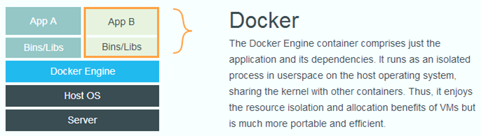
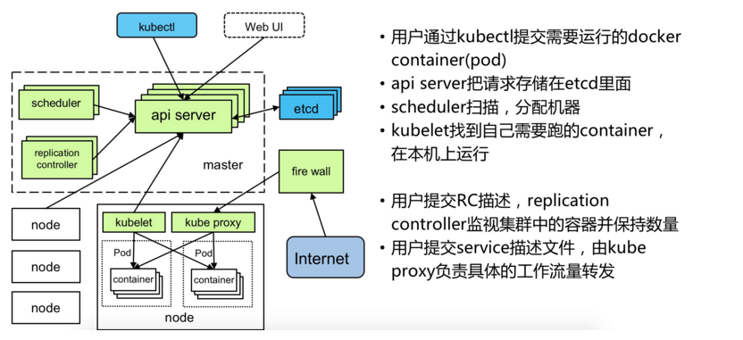

# Docker&Kubernetes 介绍

Created by 姜岳松

---


# Docker

---
<!--header: Docker-->
## 什么是docker？

> 一个工具平台,对linux容器的封装，提供简单易用的接口，方便开发者快速的构建、部署和管理容器化的应用。

要理解docker，首先要明白**容器**的概念


---

首先看一下，一个完整的计算机，其架构如下
```
+--------------------------+
|       Applications       |
+--------------------------+
|+------------------------+|
||    Runtime Library     ||
|+------------------------+|
||         Kernel         ||
|+------------------------+|
|     Operating System     |
+-----+--------+-----------+
| CPU | Memory | IO Device |
+-----+--------+-----------+
```

操作系统负责管理底层的硬件资源，并通过内核+运行库为软件提供运行环境

---
## 实际存在的问题
1. 单台服务器cpu、内存很大，性能过剩
2. 单服务器安装多个应用，环境之间互相影响

---
## 解决方案
##### 1 硬件虚拟化Hypervisor
又叫做虚拟机监视器，有两种形式
```
                             +-----+-----+-----+-----+
                             |App A|App B|App C|App D|
+-----+-----+-----+-----+    +-----+-----+-----+-----+
|App A|App B|App C|App D|    |Guest|Guest|Guest|Guest|
+-----+-----+-----+-----+    | OS0 | OS1 | OS2 | OS3 |
|Guest|Guest|Guest|Guest|    +-----+-----+-----+-----+
| OS0 | OS1 | OS2 | OS3 |    |        Hypervisor     |
+-----+-----+-----+-----+    +-----------------------+
|        Hypervisor     |    |         Host OS       |
+-----------------------+    +-----------------------+
|        Hardware       |    |        Hardware       |
+-----------------------+    +-----------------------+
          Type I                       Type II
```

---
这种架构有一定的实用性，例如可以在一台物理机上安装不同的系统，或者划分多个系统。
但是Guest OS通常会占用不少硬件资源，不可能为每个应用分配一个虚拟机。
于是操作系统层虚拟化——容器概念的提出,多个应用使用同一个操作系统。

---
##### 2 Linux cgroup
利用cgroup，把应用和运行库打包在一起，就可以实现隔离
```                             
     +-----+-----+-----+-----+     
     |App A|App B|App C|App D|    
     +-----+-----+-----+-----+   
     |Lib A|Lib B|Lib C|Lib D|     
     +-----+-----+-----+-----+     
     |    Container Engine   |     
     +-----------------------+    
     |         Host OS       |     
     +-----------------------+     
     |        Hardware       |     
     +-----------------------+     
            Container                 
```

---

每个App+Lib就构成了完整的容器。底层都是一个操作系统，所以应用启动快，且占用的额外资源少。
但是cgroup使用复杂，且没有完全隔离，docker就是为了解决这些问题而诞生的。

---
## docker镜像


docker把上述的App+Lib打包成一个文件，称为镜像。

Docker镜像不是一个独立的文件，其包含了一些元数据信息，并采用类似快照的方式，可以对已有快照修改形成新的快照，因此多个镜像可以共享相同的快照，节省镜像占用的空间。

---

## docker容器
容器是镜像的一个运行实例.

容器是完全隔离的，利用cgroup+namespace实现。

可以控制cpu、内存(可以查看容器内cpu和内存的配置文件），通过网桥隔离网络，磁盘隔离

---


## 为什么使用docker
1. 装一个软件，但是折腾了半天配置，还是运行不起来？

2. 系统装了JDK7,但是运行需要JDK8？

3. 机器要跑很多应用，配置会冲突？

---
## docker architecture


---
## 镜像从哪里来

1. 镜像仓库，可以是私有的，也可以是公共的，类似于maven reposity
	```
	docker pull centos7:latest
    ```
2. 从tar包加载```docker load -i xxx.tar```
4. dockerfile自己构建:使用 ```docker build```命令根据dockerfile建立镜像到本地， 通过```docker save -o xxx.tar image:tag```将镜像保存成tar包
3. 存储运行中的镜像：```docker commit```

---

## Dockerfile示例

```
FROM node:12-alpine
RUN apk add --no-cache python g++ make
WORKDIR /app
COPY . .
RUN yarn install --production
CMD ["node", "src/index.js"]
```

[代码下载](https://github.com/docker/getting-started/tree/master/app)

---
执行以下命令构建镜像
```
docker build -f Dockerfile -t getting-started:v1 .
```

- -f 指定docker file文件，如果是```Dockerfile```且在当前文件夹，可省略
- -t 指定镜像的tag， 镜像的tag就是镜像的名称+版本，如果不写版本，默认是latest
- 最后有个```.```，这个代表当前目录，dockerfile中对文件的操作都是基于这个目录的，也可以指定为其它目录

查看本地镜像：```docker images```

---

## 从镜像到容器
```docker run  –d  imagename:version args```
- -d是后台运行
- args是运行参数

---

例如我要将上面的程序运行起来，可以使用
```
 docker run -d -p 3000:3000 --name demo -v /home/test:/Users/jiangys/docker/test getting-started:v1
```
解释：
- --name 指定容器的名字，方便查找操作
- -p 指定端口，格式为宿主机端口:容器端口
- -v 指定挂载卷(volume)，格式为容器外目录：容器内目录
- -d 后台运行，可以使用-it代替使程序前台运行

---
容器隔离体现在哪里？
- 网络是和外部隔绝的，所以需要使用-p暴露容器端口到宿主机端口；
- 容器的文件，在容器重启、停止后也会消失，所以指定volume,将容器内的某个目录和容器外目录绑定，这样容器的绑定目录下的文件都会存储在容器外的目录。容器删除了文件也依旧存在。
- 可以限制内存和cpu

---

### 实例2：

```
docker run -it --rm -p 3000:3000 --name demo -v /home/test:/Users/jiangys/docker/test getting-started:v1
```
在前台启动，--rm指明结束后自动删除容器，适合调试时使用。

### 实例3
```
docker run -it --rm getting-started:v1 /bin/bash
```
在前端启动容器，并进入，但是没有运行任何应用

---

### 实例4
```
docker run -d --name test getting-started:v1  tail -f /dev/null
```
上述运行容器，执行了一个永不结束的命令```tail -f /dev/null```, 这样可以方便进入容器查看文件，也可以在容器内手动将程序运行起来

---
## 容器管理
- docker ps查看正在运行的容器

- docker exec -it {container name} /bin/bash 进入容器
	例如上述容器，进入mda为```docker exec -it demo /bin/bash```
   	其中，容器名可以用id代替，id只需要前几位即可，不用写全

---
<!--header: Kubernetes-->
# kubernetes


---
## docker使用中的问题
试想以下场景：
1. 集群部署，每台机器上都要启动一堆容器，要配置网络
2. 容器挂了怎么办？
3. 容器之间相互依赖
4. 扩容，缩容
5. 集群资源的规划

可以用一些工具解决(例如ansible)，但是需要定制化的工作量很大，当集群比较大时，工作量可想而知。docker提供了docker-compose用于单机的容器编排，而Kubernetes就是为了解决集群的容器管理

---

# 什么是kubernetes
一个容器编排工具，用于管理容器

---
# Kubernetes功能
- 容器的管理
	负责启动容器/监控容器状态（失败重启）
- 容器的调度
	调度到某一台物理机/修改副本数扩容/调度策略（label，优先级，抢占策略）
- 服务发现
	通过kube-dns实现基于服务名的服务发现
- 负载均衡
	service提供负载均衡功能，也可以接入第三方的负载均衡

---
# kubernetes概念
简称**K8S**
## 概念
- Master
	集群的主节点，负责集群容器的调度，状态的监控
- Node
	集群的普通节点，负责运行pod
- Pod
	k8s管理的最小单位，一个pod内运行多个容器，k8s的操作都是以pod为单位

---
# kubernetes架构
一台装有k8s的主机可以同时作为master和node节点，可以通过命令```kubectl get node```查看
一台物理机(node)上可以运行多个pod，每个pod内可以运行多个container， 同一个pod内的多个container共享外部存储和网络，可以通过localhost访问。k8s把docker中的部分容器级别的隔离，变成了pod级别的隔离 

---



---

# Pod
```kubectl get pods (-o wide)```查看pod信息
多种使用方式:
1. 一个pod多个容器，每个容器运行一个或多个程序 ❌
2. 一个pod一个容器，容器运行一个或多个程序 ❌ ---不方便管理和监控
3. 建议一个pod运行一个或多个容器，每个容器运行一个程序，方便资源控制

---
# Pod

```kubectl describe pod {pod-name}``` 查看pod信息，配置文件中配置最终会转换为pod的配置，可以根据此命令查看配置是否和配置文件一致，是否正确;同时，该命令会显示pod运行前的信息，在遇到pod一直处于pending状态的问题时可以查看（通常是资源不足，无法调度）

---
# Pod

```kubectl logs {pod-name} (-c {container-name}）```查看pod内容器的日志，只有一个容器时，可以不指定-c，有多个容器时，使用-c指定容器

初始化容器：在容器内进行一些初始化操作，如等待某个pod运行，初始化容器完成退出后，pod的容器才会开始运行

---
# service
k8s对外提供服务的方式，目前经常使用的有两种，clusterip, 和nodeport。
- clusterip的方式，ip只能在集群内访问，即只有在集群内的node上才能访问；
- nodeport会生成一个物理机端口，可以通过物理机ip进行访问
- 开启了集群的dns，集群内可以使用service—name 当作域名代替ip
- 通过标签选择器选择提供服务的pod

```kubectl get svc```查看

---
# workload

如果定义一个pod，则只是运行一个pod，但是需要多副本的管理，就要用到k8s的工作负载类型的组件。
工作负载的作用是：根据声明创建并调度pod。
- ReplicaSet
	早期的调度组件，现在已经不推荐直接使用

---
- Deployment
	无状态调度，各个节点之间平等，pod的每个副本名称为deployname+版本hash+随机字符串
    ```kubectl get deploy xxx```查看
	特点：无状态，可并行更新
---
- Statefulset
	有状态调度，每个节点是有状态的（有唯一的节点id），具体如何利用节点id这个状态，由业务决定。
    ```kubectl get sts xxx```查看
    在容器中，环境变量```HOSTNAME```为xxx-0, xxx-1的形式
	特点：顺序启动、逆序停止、更新；每个pod操作前，其前一个pod一定是running状态；利用dns，可以通过{pod_name}-N.{svc}的方式，访问指定pod

---
# 存储
把容器内的目录映射到容器外的空间。容器内的文件，每次容器重启时都会重置，文件的修改都是不保存的，只有将文件、目录映射到容器外的空间才能持久化保存。
- PV（persistent volume)
	定义了一种存储
- PVC（persistent volume claim)
	是一个声明，每个pvc都会绑定一个pv后才能使用，pod直接绑定pvc，可以动态替换pv的实现，而对pod无感知
    
---

# configMap
可以理解为一种只读存储，用于存储少量的配置信息，只支持文本文件
可以将一个或多个文件，也可以将一个文件夹定义为一个configmap。
configmap可以当做存储卷，挂载到容器的某一个目录中。也即将configmap代表的文件、文件夹放到容器中

---
<!-- _class: lead -->
# yaml 配置文件

---
# 命令行操作
## 1. 从yaml到kubernetes资源
``` kubectl apply -f test.yaml```
修改yaml后，再次执行该命令，可应用修改后的配置
删除对象：
```kubectl delete -f test.yaml```

---

# 命令行操作

1. ```kubectl get <resource>```
2. ```kubectl get <resource> -o wide```
4. ```kubectl describe <resource> <resource_name>```
5. ```kubectl logs <pod_name> -c <container_name>```
6. ```kubectl delete <resource> <resource_name>```

resource可以为：node,pod,service,deployment,statefulset,configmap，pv,pvc等等yaml中一切为kind的东西。 service可以简写为svc, deployment简写deploy,statefulset简写sts， configmap简写cm

---
# 命令行操作
kubernetes也有类似于docker exec的命令：kubectl exec 
```
kubectl exec -it (-c container_name) pod_name /bin/bash
```

---
<!-- _class: lead -->
# Thanks for Your Attention~!

